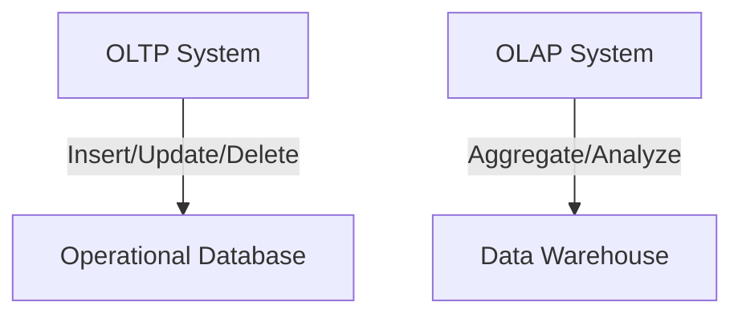
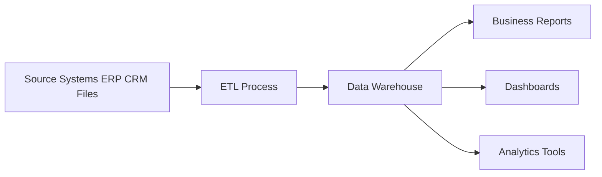
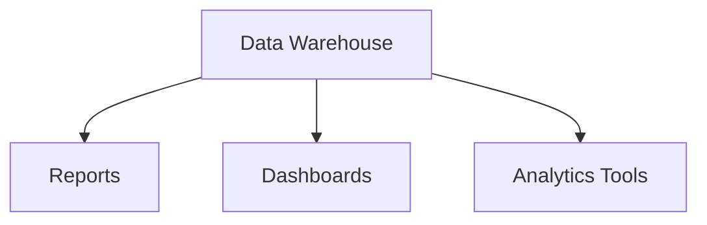
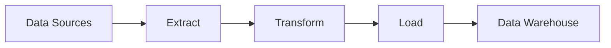

---

# 🧱 2. Introduction to Data Warehousing

A **Data Warehouse** is a system used to store and analyze large amounts of data. It plays a key role in **reporting**, **dashboards**, and **analytics**, supporting **business decision-making**.

---

## 🔄 Difference Between OLTP and OLAP

### 🔹 What is OLTP?

**OLTP (Online Transaction Processing)** is used for managing **day-to-day operations**. It supports a high volume of short, simple transactions.

* **Examples**: ATM withdrawals, placing an order, booking a ticket.

### 🔹 What is OLAP?

**OLAP (Online Analytical Processing)** is used for **data analysis**, reporting, and trend evaluation. It supports complex queries over large amounts of historical data.

* **Examples**: Sales trends, quarterly performance, market analysis.

### 📊 Visual Comparison

| Feature     | OLTP                             | OLAP                                |
| ----------- | -------------------------------- | ----------------------------------- |
| Purpose     | Real-time transaction processing | Business intelligence and analytics |
| Data Volume | Low to Medium                    | Large, historical                   |
| Users       | Frontline staff, customers       | Analysts, managers                  |
| Structure   | Highly normalized                | Denormalized (Star/Snowflake)       |
| Query Type  | Short, fast                      | Long, complex                       |

---

## 🏢 What is a Data Warehouse?

### 🔹 Definition

A **Data Warehouse** is a **centralized storage system** that integrates data from different sources and makes it available for **reporting and analysis**.

### 🧱 Key Features

* **Subject-Oriented**: Focuses on business domains like sales, products, or finance.
* **Integrated**: Combines data from multiple systems in a uniform way.
* **Time-Variant**: Stores data over long periods (e.g., years of sales).
* **Non-Volatile**: Once loaded, data is stable and not updated frequently.

### 📦 Simple Architecture Diagram

### 🔍 Why Is It Needed?

* To **unify data** from different sources
* To support **fast and complex queries**
* To enable **historical analysis** and **business intelligence**

---

## 📈 Use Cases of a Data Warehouse

### 🔹 Reporting

* Daily, weekly, monthly reports on business metrics.
* Example: “Top 10 products sold last month.”

### 🔹 Dashboards

* Interactive, visual summaries of key performance indicators.
* Example: A live sales dashboard for regional managers.

### 🔹 Analytics

* Deep, statistical analysis to find trends or make predictions.
* Example: Forecasting future demand for a product.

### 📊 Use Case Visualization

### 🔍 Why These Are Needed?

* Improve **decision-making** with accurate and timely data
* Detect **trends and patterns** for long-term planning
* Provide **self-service tools** for analysts and non-technical users

---

## 🔁 ETL (Extract, Transform, Load) Process

### 🔹 What is ETL?

ETL is the process used to move and prepare data from various sources into a data warehouse.

1. **Extract**: Pull raw data from source systems (databases, APIs, files).
2. **Transform**: Clean, filter, and format the data.
3. **Load**: Push the transformed data into the data warehouse.

### 🔄 ETL Flow Diagram

### 🔍 Why Is ETL Needed?

* To **clean and unify** data from diverse sources
* To **apply business logic** and data rules
* To make data **analysis-ready** for reporting and decision-making

---

## ✅ Summary

| Concept        | What It Is                                 | Why It’s Needed                                        |
| -------------- | ------------------------------------------ | ------------------------------------------------------ |
| OLTP           | Handles real-time transactions             | For daily business operations                          |
| OLAP           | Performs complex analysis on large data    | For decision-making and business insights              |
| Data Warehouse | Central system for storing analytical data | To organize, unify, and query historical business data |
| Use Cases      | Reporting, Dashboards, Analytics           | Help users understand and act on business performance  |
| ETL            | Extracts, cleans, and loads data           | Makes data usable and reliable for analysis            |

---
