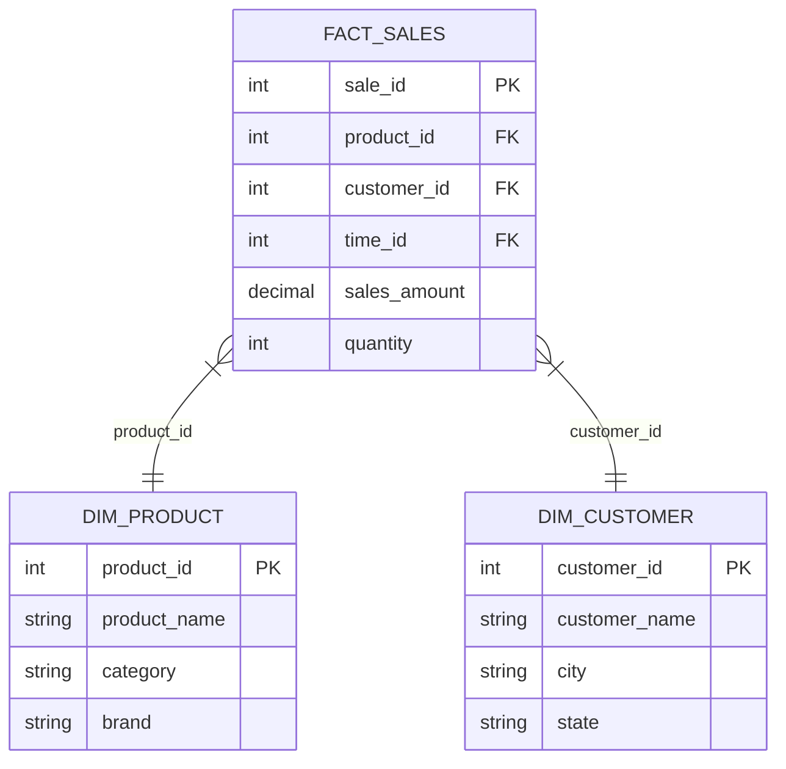
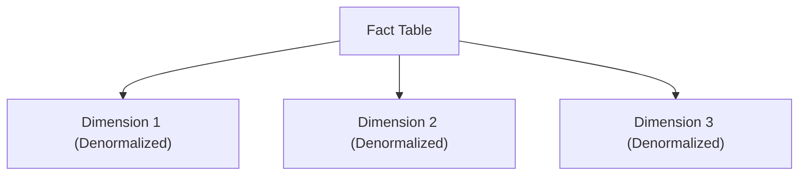
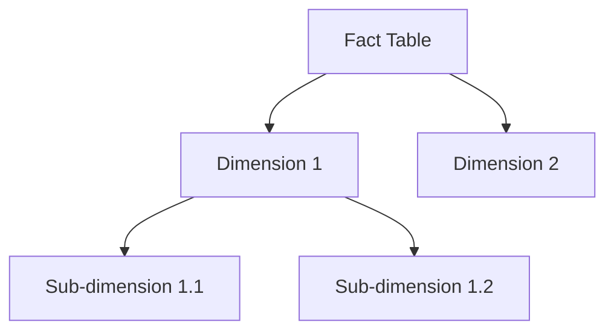

---

# 📦 3. Dimensional Modeling

Dimensional modeling is a design technique used in data warehousing to structure data for efficient querying and reporting. It is the foundation of **star schemas** and **snowflake schemas**.

---

## 📊 What is Dimensional Modeling?

* Organizes data into **Fact Tables** and **Dimension Tables**.
* Optimizes for **query performance** and **ease of understanding** by business users.
* Enables slicing and dicing of data using dimensions.

---

## 🧮 Fact Tables

### Definition:

* **Fact tables** store **numeric, measurable data** related to business processes.
* Examples of facts: sales revenue, quantity sold, number of calls, etc.
* Fact tables often contain **foreign keys** referencing dimension tables.

### Characteristics:

* Contains **measures** (quantitative data).
* Keys link to dimension tables to provide context.

### Example:

| sale\_id | product\_id | customer\_id | time\_id | sales\_amount | quantity |
| -------- | ----------- | ------------ | -------- | ------------- | -------- |
| 1        | 101         | 5001         | 20230101 | 100.00        | 2        |
| 2        | 102         | 5002         | 20230101 | 250.00        | 5        |

---

## 🗂️ Dimension Tables

### Definition:

* **Dimension tables** store **descriptive attributes** that provide context to facts.
* Examples: product name, customer name, store location, date.

### Characteristics:

* Contain **textual or categorical data**.
* Used to **filter**, **group**, and **label** facts.

### Example:

| product\_id | product\_name | category    | brand  |
| ----------- | ------------- | ----------- | ------ |
| 101         | Smartphone    | Electronics | BrandA |
| 102         | Laptop        | Electronics | BrandB |

| customer\_id | customer\_name | city     | state |
| ------------ | -------------- | -------- | ----- |
| 5001         | Alice          | New York | NY    |
| 5002         | Bob            | Chicago  | IL    |

---

## 🏗️ Visualizing Fact and Dimension Tables

---

## ⚖️ Measures vs. Attributes

| Term          | Definition                                   | Example                         |
| ------------- | -------------------------------------------- | ------------------------------- |
| **Measure**   | Numeric data that can be aggregated          | Sales amount, quantity, profit  |
| **Attribute** | Descriptive data used for filtering/grouping | Product name, customer location |

---

## ➕ Types of Facts (Measures)

### 1. Additive Facts

* Can be summed across **all dimensions**.
* Example: sales amount, quantity sold.

### 2. Semi-Additive Facts

* Can be summed across **some dimensions**, but not all.
* Example: account balance (can sum across accounts but not across time).

### 3. Non-Additive Facts

* Cannot be summed across any dimension.
* Example: ratios or percentages (e.g., profit margin).

---

## 🔍 Summary Table of Fact Types

| Fact Type     | Can be Aggregated Across | Example                |
| ------------- | ------------------------ | ---------------------- |
| Additive      | All dimensions           | Sales amount, quantity |
| Semi-Additive | Some dimensions          | Account balance        |
| Non-Additive  | None                     | Profit margin, ratios  |

---

Absolutely! Here’s the **separate section** on **Star Schema and Snowflake Schema** diagrams with explanations, ready to paste right below your Dimensional Modeling content:

---

# ⭐ Star Schema and ❄️ Snowflake Schema

Dimensional modeling is often implemented using **Star** or **Snowflake** schemas, which organize fact and dimension tables differently.

---

## ⭐ Star Schema

* Has a **central fact table** connected directly to **denormalized dimension tables**.
* Dimension tables contain **all descriptive attributes in one table**.
* Simplifies queries and is easier to understand.
* Faster query performance due to fewer joins.

### Star Schema Diagram

---

## ❄️ Snowflake Schema

* Dimension tables are **normalized** into multiple related tables.
* Breaks down dimensions into **sub-dimensions** to reduce redundancy.
* More complex joins, but saves storage space.
* Better for detailed data integrity and maintenance.

### Snowflake Schema Diagram

---

## 📌 Key Differences

| Aspect           | Star Schema          | Snowflake Schema             |
| ---------------- | -------------------- | ---------------------------- |
| Dimension Tables | Denormalized (flat)  | Normalized (multiple tables) |
| Joins            | Fewer, simpler       | More, complex                |
| Query Speed      | Faster               | Slower due to joins          |
| Storage          | More redundant data  | Less redundancy              |
| Complexity       | Easier to understand | More complex                 |

---

