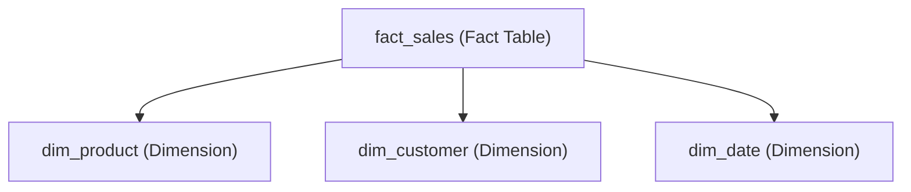

---

# ⭐ 4. Star Schema

The **Star Schema** is a common and straightforward data modeling technique used in data warehouses and dimensional modeling. It organizes data into a central **fact table** connected directly to multiple **dimension tables**, resembling a star shape—hence the name.

---

## 🏛️ Structure of a Star Schema

* **Fact Table**: Holds quantitative, measurable data (facts) like sales amounts, counts, or revenue.
* **Dimension Tables**: Hold descriptive attributes related to the facts, such as customer details, product info, or time periods.
* **Denormalized Dimensions**: Dimension tables contain all the descriptive attributes in one flat table (no splitting into sub-tables).

---

## ✔️ Key Characteristics

| Feature                 | Description                                               |
| ----------------------- | --------------------------------------------------------- |
| Central Fact Table      | Stores numeric facts and foreign keys to dimension tables |
| Denormalized Dimensions | Dimensions contain complete descriptive data in one table |
| Query Simplicity        | Easy joins between fact and dimension tables              |
| Performance             | Faster query execution due to fewer joins                 |
| Ease of Implementation  | Well supported by SQL, Pandas, and BI tools               |

---

## 🗂️ Example Schema

Imagine a retail sales database.

### Fact Table: `fact_sales`

| sale\_id | product\_id | customer\_id | date\_id | sales\_amount | quantity |
| -------- | ----------- | ------------ | -------- | ------------- | -------- |
| 1        | 101         | 5001         | 20230601 | 250.00        | 3        |
| 2        | 102         | 5002         | 20230602 | 400.00        | 5        |

### Dimension Table: `dim_product`

| product\_id | product\_name | category    | brand  |
| ----------- | ------------- | ----------- | ------ |
| 101         | Smartphone    | Electronics | BrandA |
| 102         | Laptop        | Electronics | BrandB |

### Dimension Table: `dim_customer`

| customer\_id | customer\_name | city     | state |
| ------------ | -------------- | -------- | ----- |
| 5001         | Alice          | New York | NY    |
| 5002         | Bob            | Chicago  | IL    |

### Dimension Table: `dim_date`

| date\_id | date       | month | quarter | year |
| -------- | ---------- | ----- | ------- | ---- |
| 20230601 | 2023-06-01 | June  | Q2      | 2023 |
| 20230602 | 2023-06-02 | June  | Q2      | 2023 |

---

## 🌟 Star Schema Diagram



---

## 📊 Why Star Schema?

* **Simplifies Queries:** Because each dimension is directly linked to the fact table, queries can easily join fact and dimension tables to filter and group data.
* **Improves Performance:** Fewer joins mean faster query execution.
* **Easy to Understand:** Business users and analysts find star schema intuitive and easy to navigate.
* **Implementation Friendly:** Tools like SQL, Pandas, and most BI platforms are optimized for star schema.

---

## 🐼 Example: Implementing Star Schema in Pandas

```python
import pandas as pd

# Fact table
fact_sales = pd.DataFrame({
    'sale_id': [1, 2],
    'product_id': [101, 102],
    'customer_id': [5001, 5002],
    'date_id': [20230601, 20230602],
    'sales_amount': [250.00, 400.00],
    'quantity': [3, 5]
})

# Dimension tables
dim_product = pd.DataFrame({
    'product_id': [101, 102],
    'product_name': ['Smartphone', 'Laptop'],
    'category': ['Electronics', 'Electronics'],
    'brand': ['BrandA', 'BrandB']
})

dim_customer = pd.DataFrame({
    'customer_id': [5001, 5002],
    'customer_name': ['Alice', 'Bob'],
    'city': ['New York', 'Chicago'],
    'state': ['NY', 'IL']
})

dim_date = pd.DataFrame({
    'date_id': [20230601, 20230602],
    'date': ['2023-06-01', '2023-06-02'],
    'month': ['June', 'June'],
    'quarter': ['Q2', 'Q2'],
    'year': [2023, 2023]
})

# Joining fact with product dimension
sales_with_product = fact_sales.merge(dim_product, on='product_id')

print(sales_with_product)
```

---

## 🔍 Summary

| Aspect           | Star Schema                                 |
| ---------------- | ------------------------------------------- |
| Fact Table       | Central table with measurable data and keys |
| Dimension Tables | Denormalized, descriptive attributes        |
| Query Complexity | Simple, fewer joins                         |
| Performance      | Fast due to direct joins                    |
| Use Cases        | Common for reporting and BI                 |

---

