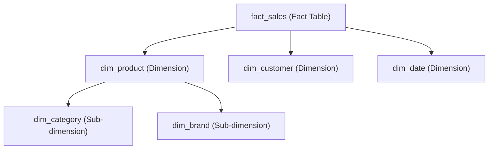

---

# ❄️ 5. Snowflake Schema

The **Snowflake Schema** is an extension of the star schema where **dimension tables are normalized** into multiple related tables. This reduces redundancy but adds complexity.

---

## 🏗️ Structure of a Snowflake Schema

* **Fact Table**: Same as in star schema, holds numeric facts and foreign keys.
* **Normalized Dimension Tables**: Dimensions are split into multiple smaller tables connected via keys.
* For example, a product dimension might be split into `Product`, `Category`, and `Brand` tables.

---

## ✔️ Key Characteristics

| Feature                 | Description                                     |
| ----------------------- | ----------------------------------------------- |
| Normalized Dimensions   | Dimension tables broken into related sub-tables |
| Reduced Data Redundancy | Saves storage and improves data integrity       |
| More Complex Joins      | Queries require more joins across tables        |
| Slightly Slower Queries | Due to additional joins                         |

---

## 🗂️ Example Schema

Continuing the retail sales example, the product dimension is snowflaked into multiple tables:

### Fact Table: `fact_sales` (same as star schema)

| sale\_id | product\_id | customer\_id | date\_id | sales\_amount | quantity |
| -------- | ----------- | ------------ | -------- | ------------- | -------- |
| 1        | 101         | 5001         | 20230601 | 250.00        | 3        |
| 2        | 102         | 5002         | 20230602 | 400.00        | 5        |

### Dimension Table: `dim_product`

| product\_id | product\_name | category\_id | brand\_id |
| ----------- | ------------- | ------------ | --------- |
| 101         | Smartphone    | 1            | 1         |
| 102         | Laptop        | 1            | 2         |

### Sub-Dimension Table: `dim_category`

| category\_id | category\_name |
| ------------ | -------------- |
| 1            | Electronics    |

### Sub-Dimension Table: `dim_brand`

| brand\_id | brand\_name |
| --------- | ----------- |
| 1         | BrandA      |
| 2         | BrandB      |

---

## 🌨️ Snowflake Schema Diagram



---

## 🐼 Example: Implementing Snowflake Schema in Pandas

```python
import pandas as pd

# Fact table
fact_sales = pd.DataFrame({
    'sale_id': [1, 2],
    'product_id': [101, 102],
    'customer_id': [5001, 5002],
    'date_id': [20230601, 20230602],
    'sales_amount': [250.00, 400.00],
    'quantity': [3, 5]
})

# Dimension tables
dim_product = pd.DataFrame({
    'product_id': [101, 102],
    'product_name': ['Smartphone', 'Laptop'],
    'category_id': [1, 1],
    'brand_id': [1, 2]
})

dim_category = pd.DataFrame({
    'category_id': [1],
    'category_name': ['Electronics']
})

dim_brand = pd.DataFrame({
    'brand_id': [1, 2],
    'brand_name': ['BrandA', 'BrandB']
})

dim_customer = pd.DataFrame({
    'customer_id': [5001, 5002],
    'customer_name': ['Alice', 'Bob'],
    'city': ['New York', 'Chicago'],
    'state': ['NY', 'IL']
})

dim_date = pd.DataFrame({
    'date_id': [20230601, 20230602],
    'date': ['2023-06-01', '2023-06-02'],
    'month': ['June', 'June'],
    'quarter': ['Q2', 'Q2'],
    'year': [2023, 2023]
})

# Joining fact with product and its subdimensions
sales_with_product = fact_sales.merge(dim_product, on='product_id') \
    .merge(dim_category, on='category_id') \
    .merge(dim_brand, on='brand_id')

print(sales_with_product)
```

---

## 🔍 Summary

| Aspect           | Snowflake Schema                                            |
| ---------------- | ----------------------------------------------------------- |
| Fact Table       | Central table with measurable data and keys                 |
| Dimension Tables | Normalized, split into multiple tables                      |
| Query Complexity | More complex, requires more joins                           |
| Performance      | Slightly slower than star schema                            |
| Use Cases        | When data integrity and storage optimization are priorities |

---
